# Continuous Testing with Synthetic Data using GitHub Action #
[](https://github.com/judebantony/continuoustesting-github-action-example/actions/workflows/workflow.yml)

[](https://gitpod.io/#https://github.com/judebantony/continuoustesting-github-action-example)
## Continuous Testing in DevSecOps
Continuous testing in DevSecOps is a type of software testing that involves testing at every stage of the development life cycle. The goal of continuous testing is to evaluate the quality of the software as part of a continuous delivery process, by testing early and often. 

The old way of testing was hand off centric. The software was handed off from one team to another. A project would have definite Development and QA phases. QA teams always wanted more time to ensure quality. The goal was that the quality should prevail over project schedule.

In this day and age, businesses need faster delivery of softwares to the end user. The newer is the software, the better it can be marketed and thus the revenue potential of the company increases. Continuous Testing is a procedure of testing early - regularly - everywhere and automate. Continuous testing means undisrupted validation done on a continuous basis. In a Continuous DevSecOps process, a software change continuously moves from Development to Testing to Deployment. This process helps us to find the risk, address them and improve the quality of the product early.

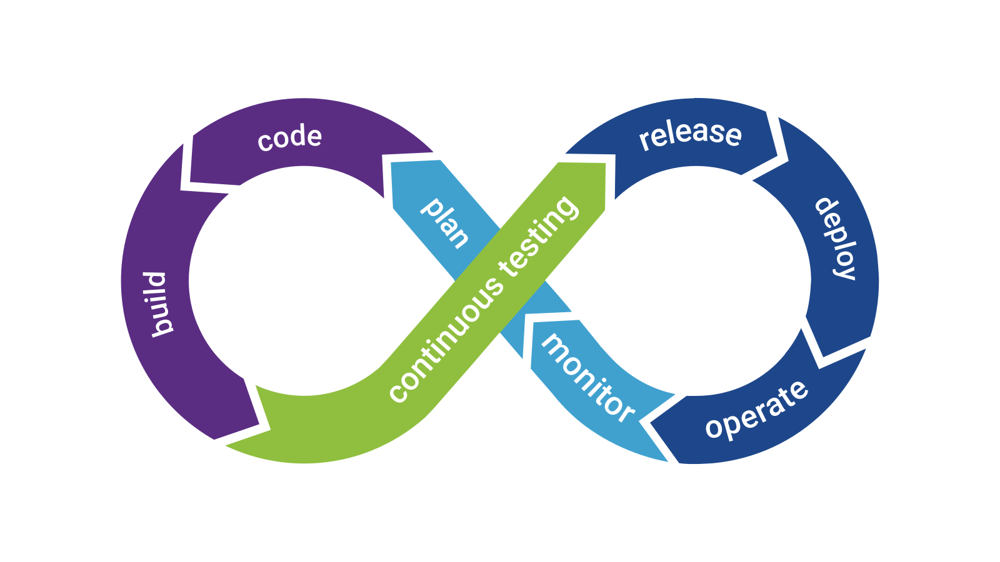

## Data Driven Testing 

Data-driven testing (DDT), also known as table-driven testing or parameterized testing, is a software testing methodology performed using a table of conditions directly as test inputs and verifiable outputs. In the simplest form the tester supplies the inputs from a row in the table and expects the outputs which occur in the same row. The table typically contains values which correspond to boundary or partition input spaces. In the control methodology, test configuration is "read" from a database/csv/excel sheet.

[Cucumber](https://cucumber.io) is an open-source testing framework that supports Behavior Driven Development for automation testing of web applications. The tests are first written in a simple scenario form that describes the expected behavior of the system from the user’s perspective. It explains the behavior of the application in a simple English text using [Gherkin](https://cucumber.io/docs/gherkin/) language.

[Selenium](https://www.selenium.dev) is an open-source umbrella project for a range of tools and libraries aimed at supporting web browser automation. Selenium provides a playback tool for authoring functional tests without the need to learn a test scripting language


## Synthetic Data for Privacy Preservation

Software engineers and data scientists often need access to large volumes of real data to develop, experiment and innovate. Collecting such data often introduces security liabilities and privacy concerns which affect individuals, organizations and society at large. Data containing Personally Identifiable Information (PII) and Personal Health Information (PHI) are particularly vulnerable to disclosure and need to be protected.

Regulations such as the General Data Protection Regulation (GDPR) serve to provide a level of legal protection for user data, but consequently introduce new technical challenges by restricting data usage, collection and storage methods. Synthetic data could serve as a viable solution to protect user data privacy, stay compliant with regulations, and still maintain the pace and ability for development and innovation.

Synthetic data generation (SDG) is rapidly emerging as a practical privacy enhancing technology (PET) for sharing data for secondary purposes. It does so by generating non-identifiable datasets that can be used and disclosed without the legislative need for additional consent given that these datasets would not be considered personal information.

Privacy engineering is a set of tools and APIs which will Synthesize, Classify and Transform your data in minutes. [Gretel](https://gretel.ai/) is a SaaS offering which simplifies  creation of anonymized and synthetic datasets so that you can work safely with data while preserving its privacy.

## Create Synthetic Data using Gretel.ai
[Gretel](https://gretel.ai/) has CLI, APIs and web based portal SaaS offering for creating synthetic data. The in-build machine learning models train on your datasets and generate synthetic data that are statistically equivalent to your input dataset. It automatically labels data and performs privacy-preserving transformations on any dataset. 

#### Kaggle - Sample dataset for training
[Kaggle](https://www.kaggle.com/datasets) a subsidiary of Google LLC, is an online community of data scientists and machine learning practitioners. Kaggle allows users to find and publish data sets, explore and build models in a web-based data-science environment, work with other data scientists and machine learning engineers, and enter competitions to solve data science challenges.
 
Sample dataset from Kaggle is present [here](https://github.com/judebantony/continuoustesting-github-action-example/tree/main/doc/dataset.csv) 

Kaggle dashboard:-
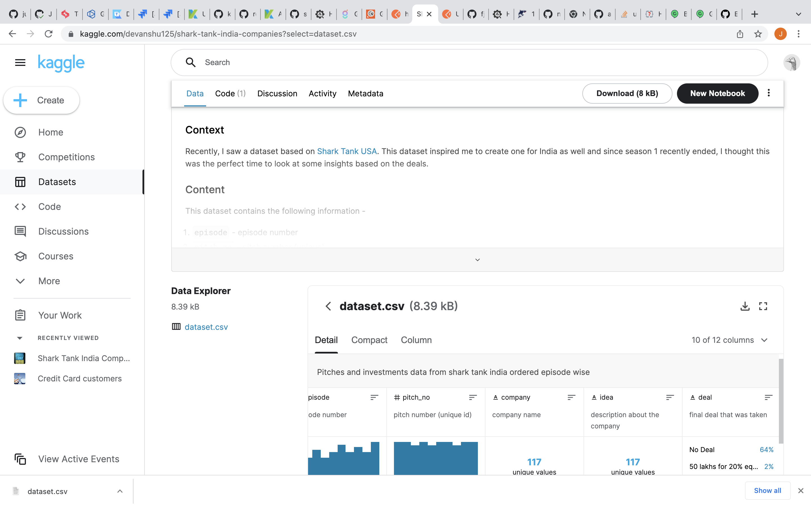

#### Gretel.ai - Synthetic data

1) Create a project in Gretel</br>
Gretel dashboard:-
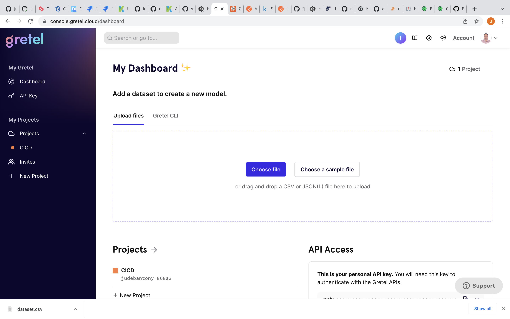

2) Create a model in Gretel and upload the data set</br>
Create model:-
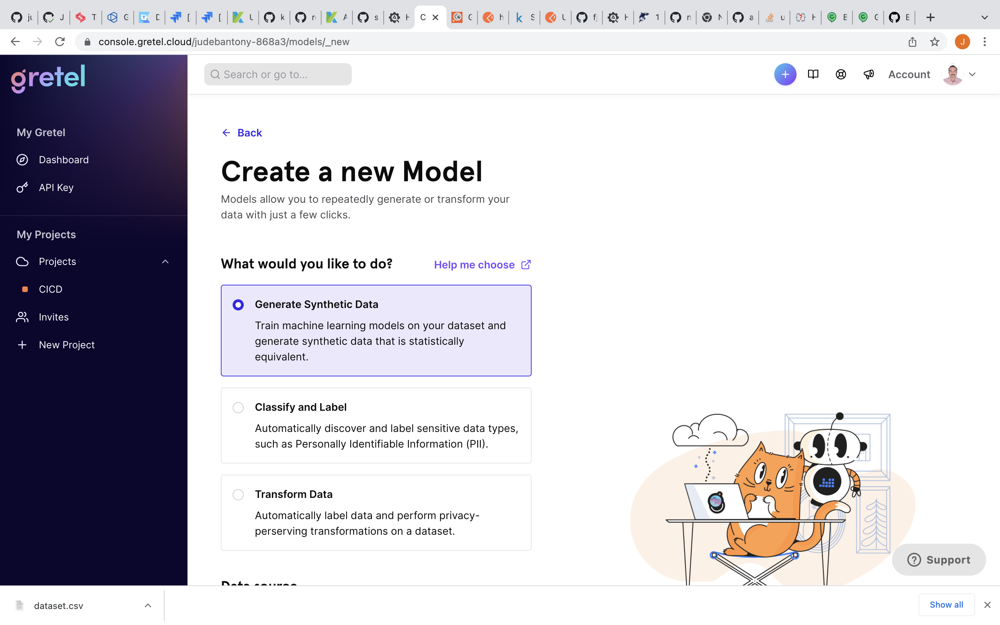

3) Train the ML model with configuration and validate

Train the ML Model:-
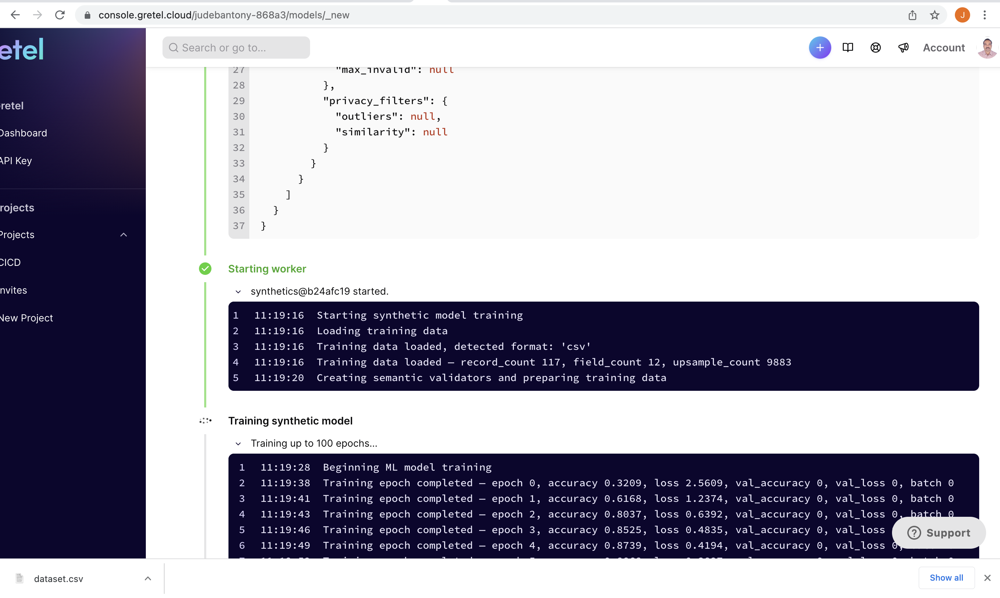
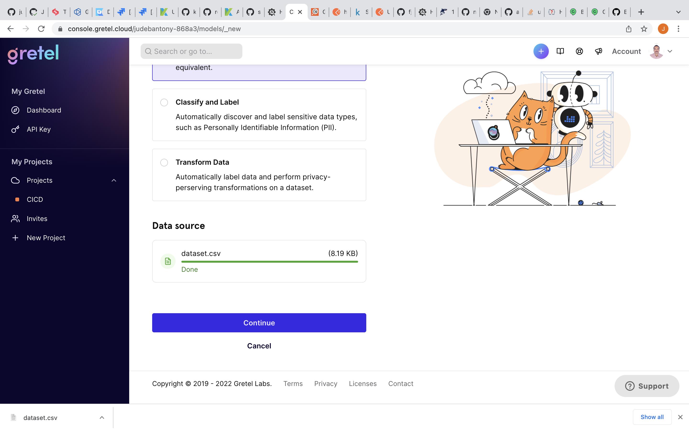
Validate the Model:-
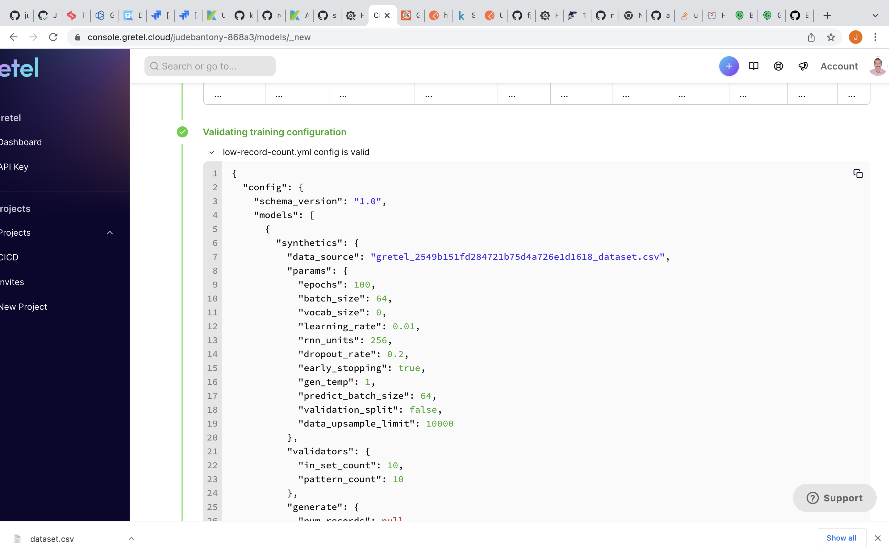
Model Output:-
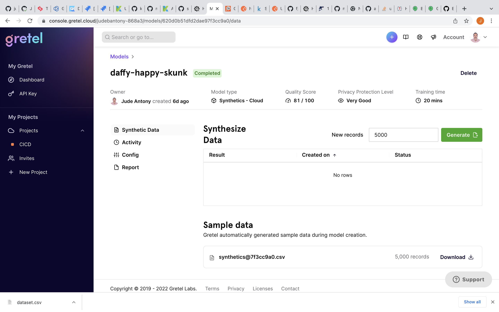
Model Download:-
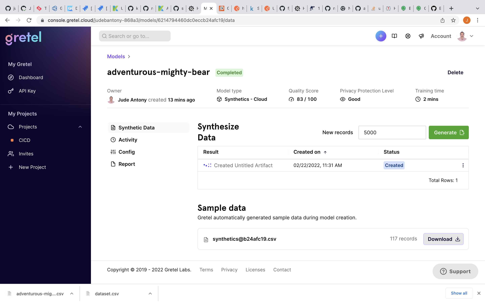
Model Report:-
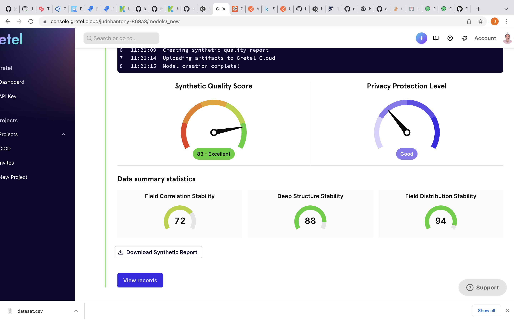


## Integrating Continuous Testing tools using GitHub Action ##
Integration & Implementation of Continuous Testing workflow using [Github Action](https://github.com/features/actions), this has been achieved using GitHub Cloud, Gretel & LamdaTest SaaS tools listed below.

### 1) Gretel - Download Synthetic Test Data File from Gretel SaaS
Download already modeled & trained Synthetic Test Data from [Gretel](https://gretel.ai/) SaaS and uploaded as artifact in GitHub. This data is used for our Functional Testing.

```yaml

  syntheticDataDownload:
    name: Download Synthetic Test Data File from Gretel  
    runs-on: ubuntu-latest
    
    steps:
    - name: Get Synthetic Test Data File
      id: myRequest
      uses: fjogeleit/http-request-action@master
      with:
        url: 'https://api.gretel.cloud/projects/${{env.GRETEL_PROJECT}}/models/${{env.GRETEL_MODEL}}/artifact?type=data_preview'
        method: 'GET'
        customHeaders: '{"Authorization": "${{ secrets.GRETEL_TOKEN }}"}'
    - name: Store the Response
      run: cat <<< ${{ toJSON(steps.myRequest.outputs.response) }} > gretel_out.json
    - name: Read the Respose
      id: format_script
      uses: notiz-dev/github-action-json-property@release
      with: 
          path: 'gretel_out.json'
          prop_path: 'data.url'
    - run: curl -X GET "${{steps.format_script.outputs.prop}}" > data_preview.gz
    - run: gzip -d data_preview.gz
    - run: mv data_preview ${{env.GRETEL_TEST_OUT_FILE}}
    - name: Upload code coverage report
      uses: actions/upload-artifact@v2
      with:
        name: gretel_testdata
        path: ${{env.GRETEL_TEST_OUT_FILE}}

```

GitHub artifact:-
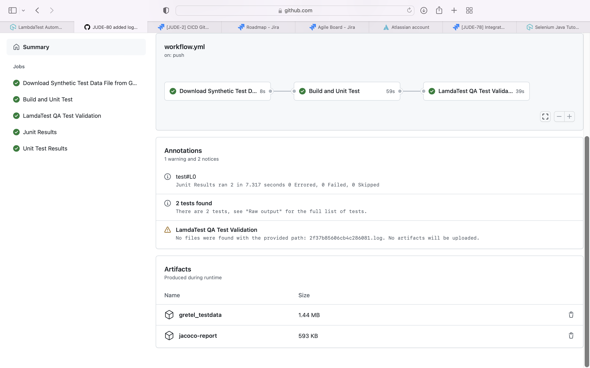


### 2) Maven - Build and Unit Test ###
[Apache Maven](https://maven.apache.org) is a software project management and comprehension tool. Based on the concept of a project object model (POM), Maven can manage a project's build, reporting and documentation from a central piece of information.

Code is build using [Maven](https://maven.apache.org) and unit test cases are executed using [JUnit](https://junit.org/junit5/)
The test coverage result, which is aggregated by [Jacoco](https://www.baeldung.com/sonarqube-jacoco-code-coverage) would be uploaded to [Github Action](https://github.com/features/actions) as artifacts. Please check [pom.xml](https://github.com/judebantony/continuoustesting-github-action-example/tree/main/pom.xml) as well. 

```yaml

  test:
    name: Build and Unit Test
    runs-on: ubuntu-latest
    
    steps:
      - name: Check out the code
        uses: actions/checkout@v1
        with:
          fetch-depth: 0
      - name: Set up JDK
        uses: actions/setup-java@v1
        with:
          java-version: 1.8
      - name: Cache Maven packages
        uses: actions/cache@v1
        with:
          path: ~/.m2
          key: ${{ runner.os }}-m2-${{ hashFiles('**/pom.xml') }}
          restore-keys: ${{ runner.os }}-m2     
      - name: Build
        run: mvn -B clean package -DskipTests
      - name: Run UnitTest and Verify 
        run: mvn -B verify -DexcludedGroups="LamdaTest"
      - name: Generate JaCoCo Badge
        id: jacoco
        uses: cicirello/jacoco-badge-generator@v2
      - name: Log code coverage percentage
        run: |
          echo "coverage = ${{ steps.jacoco.outputs.coverage }}"
          echo "branch coverage = ${{ steps.jacoco.outputs.branches }}"
      - name: Upload code coverage report
        uses: actions/upload-artifact@v2
        with:
          name: jacoco-report
          path: target/site/jacoco/
      - name: Adding Junit Report
        uses: ashley-taylor/junit-report-annotations-action@master
        if: always()
        with:
          access-token: ${{ secrets.GITHUB_TOKEN }}          
      - name: Publish Unit Test Results
        uses: EnricoMi/publish-unit-test-result-action/composite@v1
        with:
           files: target/surefire-reports/*.xml

```

In [pom.xml](https://github.com/judebantony/continuoustesting-github-action-example/tree/main/pom.xml), we need to add the jacoco plugin.

GitHub Action:-


### 3) Functional Web UI Test - Using LamdaTest. ###

Run your [Selenium](https://www.selenium.dev) test automation scripts across online selenium grid of desktop, Android and iOS mobile browsers. Develop, test and deliver faster every time with automated cross browser testing using LambdaTest online Automation Browser Testing Grid.

Execute the [Selenium](https://www.selenium.dev) [Cucumber](https://cucumber.io) based UI Test Cases using [LamdaTest](https://www.lambdatest.com/?fp_ref=aliakbar42) and capture the result. 

The feature files are present [here](https://github.com/judebantony/continuoustesting-github-action-example/tree/main/src/test/resources/com/jba/ci/ct/bdd/).

```java
@LamdaTest
Feature: Test Google Search
	Scenario: Finding some company
	   Given I am on the Google search page
	   When I search for test data from gredel
	   Then the page title should start with same test data
```

Selenium step definition jav file can be present [here](https://github.com/judebantony/continuoustesting-github-action-example/tree/main/src/test/java/com/jba/ci/ct/bdd/stepdefs).

```java

@Slf4j
@CucumberContextConfiguration
public class SeleniumStepDef {

	private static final String CONSOLE = "console";
	private static final String VIDEO = "video";
	private static final String VISUAL = "visual";
	private static final String NETWORK = "network";
	private static final String NAME = "name";
	private static final String BUILD = "build";
	private static final String RESOLUTION = "resolution";
	private static final String VERSION = "version";
	private static final String BROWSER_NAME = "browserName";
	private static final String ACCESS_KEY = "accessKey";
	private static final String USER = "user";
	private static final String PLATFORM = "platform";
	private static final String _1024X768 = "1024x768";
	private static final String _92_0 = "92.0";
	private static final String CHROME = "Chrome";
	private static final String WINDOWS_10 = "Windows 10";
	private static final String CT_TEST = "CT Test";
	private static final String GOOGLE_SEARCH_TEST = "Google Search Test";
	private static final String Q = "q";
	private static final String LT_ACCESS_KEY = "LT_ACCESS_KEY";
	private static final String LT_EMAIL = "LT_EMAIL";
	private static final String GRETEL_TEST_OUT_FILE = "GRETEL_TEST_OUT_FILE";
	private static final String HTTPS = "https://";
	private static final String HUB_CLOUD_LAMADATEST_COM_WD_HUB = "@hub.lambdatest.com/wd/hub";
	private static final String COL = ":";
	private static final String GOOGLE_URL = "https://www.google.com/";
	public static final String LAMADATEST_AUTOMATE_USERNAME = System.getenv(LT_EMAIL);
	public static final String LAMADATEST_AUTOMATE_ACCESS_KEY = System.getenv(LT_ACCESS_KEY);
	public static final String GRETEL_TEST_OUT_FILE_PATH = System.getenv(GRETEL_TEST_OUT_FILE);
	private List<GretelTestData> listGretelTestData;
	private String testData;
	private WebDriver driver;

	@Before()
	public void before_getdiver() {
		getDesiredCapabilities();
		getTestData();
	}

	private void getTestData() {
		try {
			try (CSVReader reader = new CSVReaderBuilder(new FileReader(GRETEL_TEST_OUT_FILE_PATH)).withSkipLines(1)
					.build()) {
				ColumnPositionMappingStrategy<GretelTestData> strategy = new ColumnPositionMappingStrategy<>();
				strategy.setType(GretelTestData.class);
				CsvToBean<GretelTestData> csvToBean = new CsvToBeanBuilder<GretelTestData>(reader)
						.withMappingStrategy(strategy).withIgnoreLeadingWhiteSpace(true).build();
				listGretelTestData = csvToBean.parse();
				testData = listGretelTestData.get(0).getCompany();
			}
		} catch (Exception e) {
			log.error("{}", e);
		}
	}

	private void getDesiredCapabilities() {
		DesiredCapabilities caps = new DesiredCapabilities();
		caps.setCapability(PLATFORM, WINDOWS_10);
		caps.setCapability(USER, LAMADATEST_AUTOMATE_USERNAME);
		caps.setCapability(ACCESS_KEY, LAMADATEST_AUTOMATE_ACCESS_KEY);
		caps.setCapability(BROWSER_NAME, CHROME);
		caps.setCapability(VERSION, _92_0);
		caps.setCapability(RESOLUTION, _1024X768);
		caps.setCapability(BUILD, CT_TEST);
		caps.setCapability(NAME, GOOGLE_SEARCH_TEST);
		caps.setCapability(NETWORK, true);
		caps.setCapability(VISUAL, true);
		caps.setCapability(VIDEO, true);
		caps.setCapability(CONSOLE, true);
		try {
			driver = new RemoteWebDriver(
					new URL(new StringBuilder().append(HTTPS).append(LAMADATEST_AUTOMATE_USERNAME).append(COL)
							.append(LAMADATEST_AUTOMATE_ACCESS_KEY).append(HUB_CLOUD_LAMADATEST_COM_WD_HUB).toString()),
					caps);
		} catch (Exception e) {
			log.error("{}", e);
		}
	}

	@Given("I am on the Google search page")
	public void I_am_on_the_Google_search_page() {
		driver.get(GOOGLE_URL);
	}

	@When("I search for test data from gredel")
	public void search_for() {
		WebElement element = driver.findElement(By.name(Q));
		element.sendKeys(testData);
		element.submit();
	}

	@Then("the page title should start with same test data")
	public void checkTitle() {
		new WebDriverWait(driver, 40L).until(d -> {
			log.info("Gretel Test Data :: {}",testData);
			log.info("Browser Title Data :: {}",d.getTitle());
			return d.getTitle().startsWith(testData);});
	}

	@After()
	public void closeBrowser() {
		driver.quit();
	}
}

```

GitHub action job setup for LamdaTest to run the test case as part of CICD.  

```yaml 

  lamdaTest:
    name: 'LamdaTest QA Test Validation'
    runs-on: ubuntu-latest 
    needs: [test]
    
    steps:
      - name: Start Tunnel
        id: tunnel
        uses: LambdaTest/LambdaTest-tunnel-action@v1
        with:
          user: ${{ secrets.LT_EMAIL }}
          accessKey: ${{ secrets.LT_ACCESS_KEY }}
          tunnelName: "testTunnel"
      - name: Check out the code
        uses: actions/checkout@v1
        with:
          fetch-depth: 0
      - name: Set up JDK
        uses: actions/setup-java@v1
        with:
          java-version: 1.8
      - name: Cache Maven packages
        uses: actions/cache@v1
        with:
          path: ~/.m2
          key: ${{ runner.os }}-m2-${{ hashFiles('**/pom.xml') }}
          restore-keys: ${{ runner.os }}-m2     
      - name: Run LamdaTest Automation
        run: mvn -B verify -Dgroups="LamdaTest"
        env: 
          CUCUMBER_PUBLISH_TOKEN: ${{secrets.CUCUMBER_PUBLISH_TOKEN}}
          LT_EMAIL: ${{ secrets.LT_EMAIL }}
          LT_ACCESS_KEY: ${{ secrets.LT_ACCESS_KEY }}
      - name: Export Tunnel Logs for debugging
        uses: actions/upload-artifact@v2
        with:
           name: tunnel_logs
           path: ${{ steps.tunnel.outputs.logFileName }}          

```
LambdaTest dashboard:-
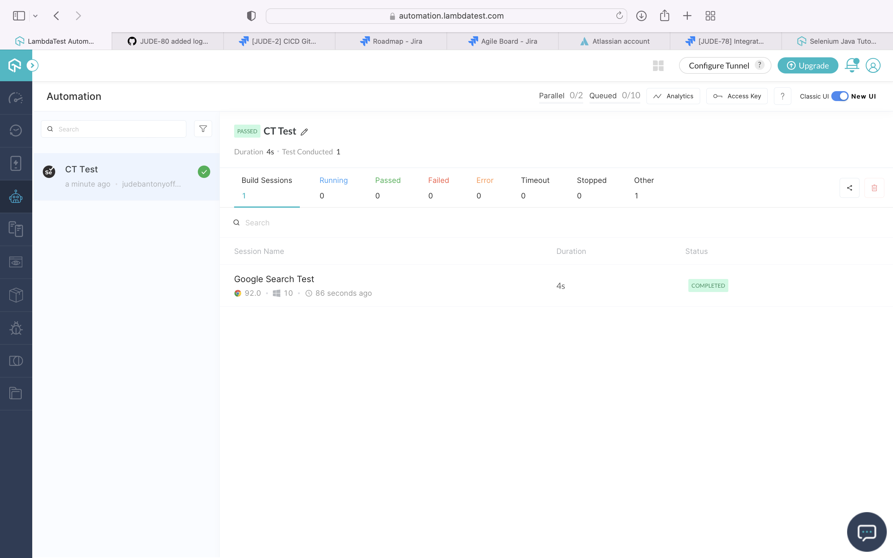

LambdaTest Test Result:-
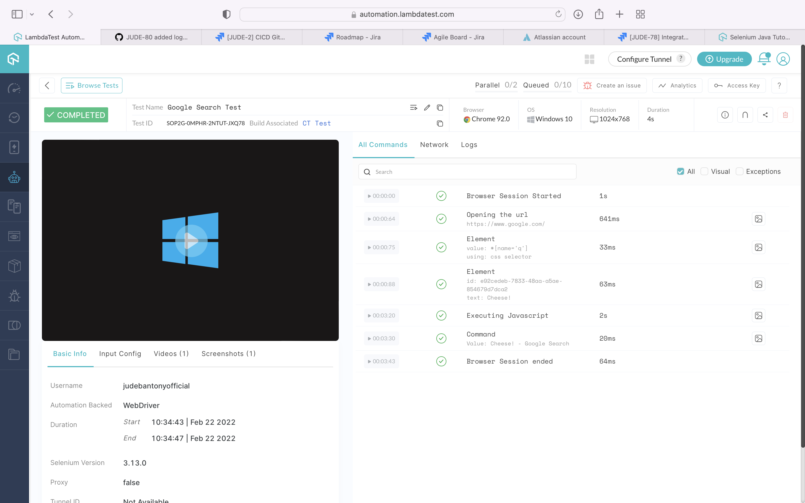
